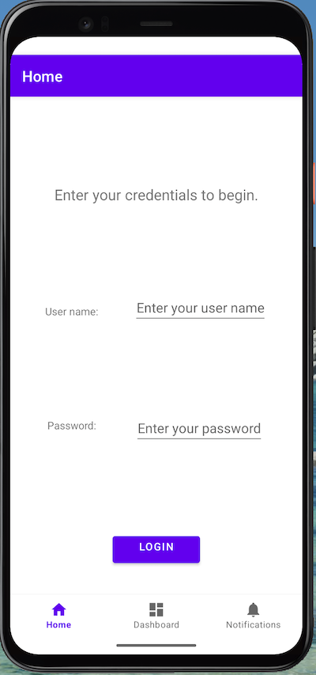
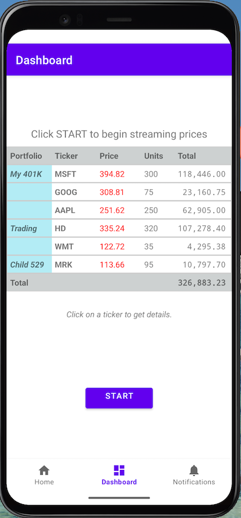
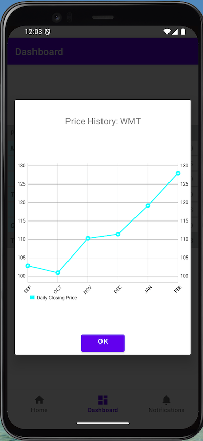
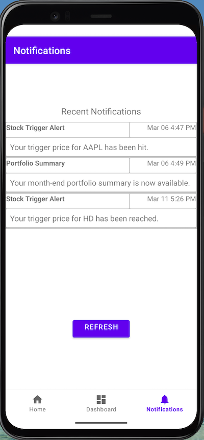

# MarketWatcher App

The MarketWatcher is an Android demo application for monitoring real-time stock prices.

The application is written in Java and is meant to illustrate some interesting features of the Android frameworks, while demonstrating some best practices. The application is only a demo, meant primarily as a learning tool.

## Pre-Requisites

To properly run the app, you will need to set up the backend software: the [MarketWatcher Server](https://github.com/rfield/MarketWatcherServer). The server application is also meant as a demonstration and is for learning purposes only.

Additionally, you will need to install Android Studio. Importing the project into Android Studio should pull in all the other required software, such as libraries and the Gradle build tool.

## How to Run

Run the application from the Android Studio IDE using any appropriate device simulator, such as Pixel 4.

## Screenshots

